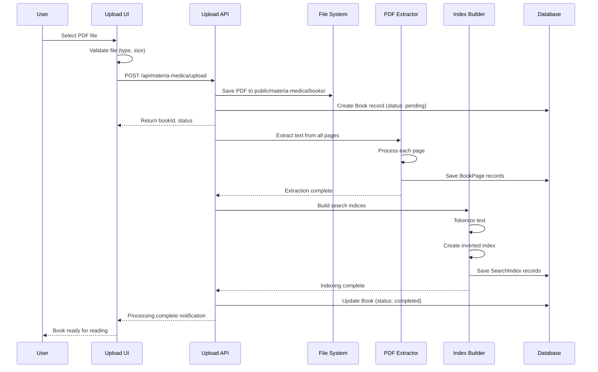
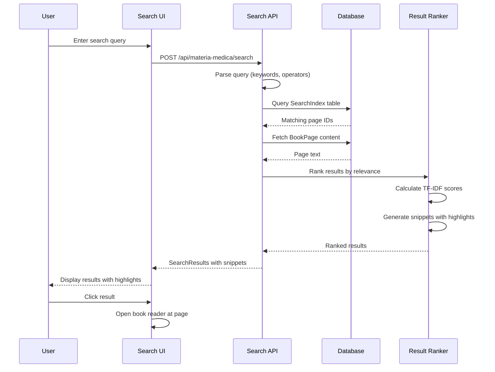
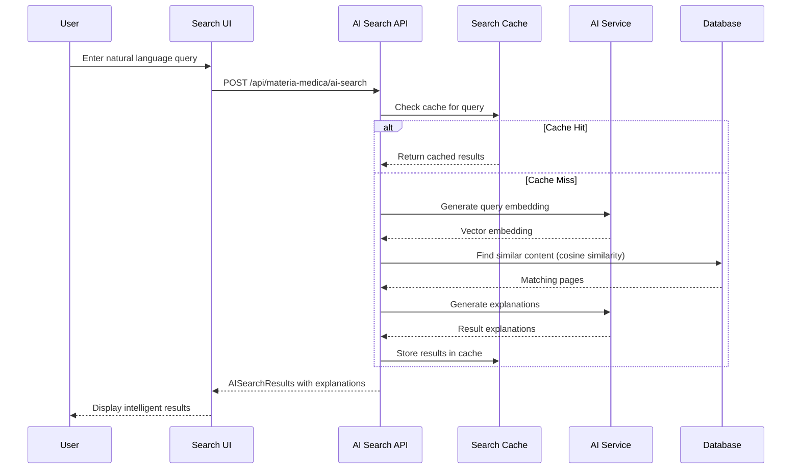

# Design Document: Materia Medica Library

## Overview

The Materia Medica Library module enables homeopathy doctors to upload, read, and search PDF reference books (Boericke, Kent, Phatak, etc.) within the clinic management system. The module provides a book-like reading experience with page navigation, full-text search across all books, and AI-powered semantic search for intelligent remedy finding. Designed for LAN deployment with multi-user access, all users can search and read books simultaneously while maintaining fast performance even with large books (1000+ pages).

The system follows an upload-once, search-forever approach: PDFs are uploaded to a local folder, content is extracted and indexed into the database, and users get instant search results without re-processing. The architecture leverages the existing localStorage-based database pattern for offline-first functionality while supporting multi-user access in a LAN environment.

## Architecture

### System Architecture Diagram

```mermaid
graph TB
    subgraph "Client Layer"
        UI[Web UI - Next.js Pages]
        Reader[Book Reader Component]
        Search[Search Interface]
        Upload[Upload Manager]
    end
    
    subgraph "API Layer"
        UploadAPI[/api/materia-medica/upload]
        SearchAPI[/api/materia-medica/search]
        BooksAPI[/api/materia-medica/books]
        AISearchAPI[/api/materia-medica/ai-search]
    end
    
    subgraph "Processing Layer"
        PDFProcessor[PDF Text Extractor]
        Indexer[Search Index Builder]
        AIService[AI Semantic Search Service]
    end
    
    subgraph "Storage Layer"
        DB[(LocalStorage Database)]
        FileSystem[Local File System<br/>public/materia-medica/books/]
    end
    
    UI --> UploadAPI
    UI --> SearchAPI
    UI --> BooksAPI
    Reader --> BooksAPI
    Search --> SearchAPI
    Search --> AISearchAPI
    
    UploadAPI --> PDFProcessor
    UploadAPI --> FileSystem
    PDFProcessor --> Indexer
    Indexer --> DB
    
    SearchAPI --> DB
    AISearchAPI --> AIService
    AIService --> DB
    BooksAPI --> DB
    BooksAPI --> FileSystem
```

### Data Flow

1. **Upload Flow**: User uploads PDF → API saves to `public/materia-medica/books/` → PDF processor extracts text from all pages → Indexer creates search indices → Metadata and content stored in database
2. **Search Flow**: User enters query → Search API queries database indices → Results ranked and returned with highlights → User clicks result → Reader opens book to specific page
3. **AI Search Flow**: User enters natural language query → AI service converts to semantic embeddings → Matches against indexed content → Returns relevant remedies with context
4. **Reading Flow**: User selects book → Reader loads PDF from file system → Displays page-by-page with navigation controls → Bookmarks and history stored in database


## Components and Interfaces

### Component 1: Book Upload Manager

**Purpose**: Handles PDF upload, validation, and processing initiation

**Interface**:
```typescript
interface BookUploadManager {
  uploadBook(file: File, metadata: BookMetadata): Promise<UploadResult>
  validatePDF(file: File): Promise<ValidationResult>
  getUploadProgress(uploadId: string): Promise<UploadProgress>
  cancelUpload(uploadId: string): Promise<void>
}

interface BookMetadata {
  title: string
  author: string
  publisher?: string
  edition?: string
  year?: number
  language: string
  category: 'materia-medica' | 'repertory' | 'philosophy' | 'other'
  tags?: string[]
}

interface UploadResult {
  success: boolean
  bookId: string
  message: string
  processingStatus: 'queued' | 'processing' | 'completed' | 'failed'
}
```

**Responsibilities**:
- Accept PDF file uploads via drag-and-drop or file picker
- Validate file type, size, and integrity
- Save PDF to local file system
- Trigger background processing for text extraction
- Provide real-time upload progress feedback
- Handle upload errors and retries


### Component 2: PDF Text Extractor

**Purpose**: Extracts 100% of text content from PDF pages for indexing

**Interface**:
```typescript
interface PDFTextExtractor {
  extractText(pdfPath: string): Promise<ExtractionResult>
  extractPage(pdfPath: string, pageNumber: number): Promise<PageContent>
  getPageCount(pdfPath: string): Promise<number>
}

interface ExtractionResult {
  bookId: string
  totalPages: number
  pages: PageContent[]
  extractionTime: number
  errors: ExtractionError[]
}

interface PageContent {
  pageNumber: number
  text: string
  wordCount: number
  hasImages: boolean
}
```

**Responsibilities**:
- Extract text from every page of the PDF
- Preserve page boundaries for accurate search results
- Handle various PDF formats and encodings
- Report extraction progress
- Handle OCR for scanned PDFs (if needed)
- Store extracted text with page references


### Component 3: Search Index Builder

**Purpose**: Creates and maintains search indices for fast full-text search

**Interface**:
```typescript
interface SearchIndexBuilder {
  buildIndex(bookId: string, pages: PageContent[]): Promise<IndexResult>
  updateIndex(bookId: string, pages: PageContent[]): Promise<IndexResult>
  deleteIndex(bookId: string): Promise<void>
  rebuildAllIndices(): Promise<void>
}

interface IndexResult {
  bookId: string
  indexedPages: number
  indexedWords: number
  indexSize: number
  buildTime: number
}

interface SearchIndex {
  bookId: string
  pageNumber: number
  words: Map<string, number[]> // word -> positions in page
  ngrams: Map<string, number[]> // 2-3 word phrases -> positions
}
```

**Responsibilities**:
- Tokenize extracted text into searchable words
- Create inverted index for fast lookups
- Build n-gram indices for phrase matching
- Store word positions for context highlighting
- Optimize index size and query performance
- Support incremental index updates


### Component 4: Book Reader UI

**Purpose**: Provides book-like reading experience with page navigation

**Interface**:
```typescript
interface BookReader {
  openBook(bookId: string, pageNumber?: number): Promise<void>
  nextPage(): void
  previousPage(): void
  goToPage(pageNumber: number): void
  setZoom(level: number): void
  addBookmark(pageNumber: number, note?: string): Promise<void>
  getBookmarks(bookId: string): Promise<Bookmark[]>
  search(query: string): Promise<SearchResult[]>
}

interface Bookmark {
  id: string
  bookId: string
  pageNumber: number
  note?: string
  createdAt: Date
}

interface ReadingHistory {
  id: string
  bookId: string
  userId: string
  lastPageRead: number
  lastReadAt: Date
  totalTimeSpent: number
}
```

**Responsibilities**:
- Display PDF pages with original formatting
- Provide page navigation (next, previous, jump to page)
- Support zoom in/out functionality
- Allow bookmarking of pages with notes
- Track reading history and last read position
- Provide in-book search with result highlighting
- Support keyboard shortcuts for navigation


### Component 5: Search Engine

**Purpose**: Executes fast full-text search across all books

**Interface**:
```typescript
interface SearchEngine {
  search(query: string, options: SearchOptions): Promise<SearchResults>
  searchInBook(bookId: string, query: string): Promise<SearchResults>
  advancedSearch(criteria: AdvancedSearchCriteria): Promise<SearchResults>
}

interface SearchOptions {
  bookIds?: string[] // Search specific books only
  caseSensitive?: boolean
  wholeWord?: boolean
  maxResults?: number
  includeContext?: boolean
  contextLength?: number
}

interface AdvancedSearchCriteria {
  mustInclude?: string[] // AND operator
  shouldInclude?: string[] // OR operator
  mustNotInclude?: string[] // NOT operator
  exactPhrase?: string
  bookIds?: string[]
  categories?: string[]
  authors?: string[]
}

interface SearchResults {
  query: string
  totalResults: number
  results: SearchResult[]
  searchTime: number
}

interface SearchResult {
  bookId: string
  bookTitle: string
  pageNumber: number
  snippet: string // Text excerpt with highlights
  relevanceScore: number
  matchCount: number
}
```

**Responsibilities**:
- Execute fast keyword searches across all indexed content
- Support boolean operators (AND, OR, NOT)
- Provide phrase matching with quotes
- Rank results by relevance
- Generate context snippets with highlighted matches
- Filter by book, author, or category
- Return results in milliseconds


### Component 6: AI Semantic Search Service

**Purpose**: Provides intelligent remedy finding using natural language understanding

**Interface**:
```typescript
interface AISemanticSearch {
  semanticSearch(query: string, options: AISearchOptions): Promise<AISearchResults>
  generateEmbedding(text: string): Promise<number[]>
  findSimilarContent(embedding: number[], topK: number): Promise<SearchResult[]>
}

interface AISearchOptions {
  maxResults?: number
  minSimilarity?: number
  bookIds?: string[]
  includeExplanation?: boolean
}

interface AISearchResults {
  query: string
  interpretation: string // AI's understanding of the query
  results: AISearchResult[]
  searchTime: number
}

interface AISearchResult extends SearchResult {
  similarityScore: number
  explanation: string // Why this result matches
  relatedRemedies: string[]
}
```

**Responsibilities**:
- Convert natural language queries to semantic embeddings
- Match queries against indexed content semantically
- Understand medical terminology and symptom descriptions
- Provide explanations for why results match
- Suggest related remedies based on context
- Handle queries like "remedy for fever with anxiety at night"


### Component 7: Book Management System

**Purpose**: Manages book metadata, organization, and lifecycle

**Interface**:
```typescript
interface BookManagementSystem {
  getAllBooks(): Promise<Book[]>
  getBook(bookId: string): Promise<Book>
  updateMetadata(bookId: string, metadata: Partial<BookMetadata>): Promise<Book>
  deleteBook(bookId: string): Promise<void>
  getBooksByCategory(category: string): Promise<Book[]>
  searchBooks(query: string): Promise<Book[]>
}

interface Book {
  id: string
  title: string
  author: string
  publisher?: string
  edition?: string
  year?: number
  language: string
  category: string
  tags: string[]
  filePath: string
  fileSize: number
  totalPages: number
  uploadedBy: string
  uploadedAt: Date
  lastAccessedAt?: Date
  accessCount: number
  processingStatus: 'pending' | 'processing' | 'completed' | 'failed'
  indexStatus: 'pending' | 'indexing' | 'indexed' | 'failed'
}
```

**Responsibilities**:
- Store and retrieve book metadata
- Organize books by category and tags
- Track book usage statistics
- Handle book deletion (file + database)
- Provide book search by title, author, or tags
- Manage book processing status


## Data Models

### Model 1: Book

```typescript
interface Book {
  id: string
  title: string
  author: string
  publisher?: string
  edition?: string
  year?: number
  language: string
  category: 'materia-medica' | 'repertory' | 'philosophy' | 'other'
  tags: string[]
  filePath: string // Relative path: materia-medica/books/{bookId}.pdf
  fileName: string
  fileSize: number // In bytes
  totalPages: number
  uploadedBy: string
  uploadedAt: Date
  lastAccessedAt?: Date
  accessCount: number
  processingStatus: 'pending' | 'processing' | 'completed' | 'failed'
  processingError?: string
  indexStatus: 'pending' | 'indexing' | 'indexed' | 'failed'
  indexError?: string
  createdAt: Date
  updatedAt: Date
}
```

**Validation Rules**:
- `title` must be non-empty string (max 500 chars)
- `author` must be non-empty string (max 200 chars)
- `language` must be valid ISO language code
- `category` must be one of the defined enum values
- `filePath` must be valid relative path
- `fileSize` must be positive number
- `totalPages` must be positive integer


### Model 2: BookPage

```typescript
interface BookPage {
  id: string
  bookId: string
  pageNumber: number
  text: string // Extracted text content
  wordCount: number
  hasImages: boolean
  extractedAt: Date
}
```

**Validation Rules**:
- `bookId` must reference valid Book
- `pageNumber` must be positive integer within book's page range
- `text` can be empty for image-only pages
- `wordCount` must be non-negative integer

### Model 3: SearchIndex

```typescript
interface SearchIndex {
  id: string
  bookId: string
  pageNumber: number
  word: string // Normalized lowercase word
  positions: number[] // Character positions in page text
  frequency: number // Occurrences on this page
  createdAt: Date
}
```

**Validation Rules**:
- `bookId` must reference valid Book
- `pageNumber` must be valid page in book
- `word` must be non-empty, normalized string
- `positions` array must contain valid character indices
- `frequency` must match positions array length


### Model 4: Bookmark

```typescript
interface Bookmark {
  id: string
  bookId: string
  userId: string
  pageNumber: number
  note?: string
  color?: string // Highlight color
  createdAt: Date
  updatedAt: Date
}
```

**Validation Rules**:
- `bookId` must reference valid Book
- `userId` must reference valid User
- `pageNumber` must be valid page in book
- `note` max length 1000 chars
- `color` must be valid hex color code if provided

### Model 5: ReadingHistory

```typescript
interface ReadingHistory {
  id: string
  bookId: string
  userId: string
  lastPageRead: number
  totalTimeSpent: number // In seconds
  sessionCount: number
  lastReadAt: Date
  createdAt: Date
  updatedAt: Date
}
```

**Validation Rules**:
- `bookId` must reference valid Book
- `userId` must reference valid User
- `lastPageRead` must be valid page in book
- `totalTimeSpent` must be non-negative
- `sessionCount` must be positive integer


### Model 6: AISearchCache

```typescript
interface AISearchCache {
  id: string
  query: string // Original query
  queryHash: string // Hash for quick lookup
  embedding: number[] // Vector embedding
  results: string[] // Cached result IDs
  hitCount: number
  lastAccessedAt: Date
  createdAt: Date
  expiresAt: Date
}
```

**Validation Rules**:
- `query` must be non-empty string
- `queryHash` must be unique
- `embedding` must be valid vector array
- `hitCount` must be non-negative
- `expiresAt` must be future date

## Main Algorithm/Workflow

### PDF Upload and Processing Workflow




### Search Workflow



### AI Semantic Search Workflow




## Key Functions with Formal Specifications

### Function 1: uploadAndProcessBook()

```typescript
async function uploadAndProcessBook(
  file: File, 
  metadata: BookMetadata, 
  userId: string
): Promise<UploadResult>
```

**Preconditions:**
- `file` is a valid PDF file (MIME type: application/pdf)
- `file.size` is less than MAX_FILE_SIZE (e.g., 100MB)
- `metadata.title` is non-empty string
- `metadata.author` is non-empty string
- `userId` references valid authenticated user
- File system has sufficient storage space

**Postconditions:**
- PDF file saved to `public/materia-medica/books/{bookId}.pdf`
- Book record created in database with status 'pending'
- Background processing initiated for text extraction
- Returns UploadResult with bookId and status
- If error occurs, no partial data persisted (atomic operation)

**Loop Invariants:** N/A (no loops in main function)


### Function 2: extractTextFromPDF()

```typescript
async function extractTextFromPDF(
  pdfPath: string, 
  bookId: string
): Promise<ExtractionResult>
```

**Preconditions:**
- `pdfPath` points to valid PDF file in file system
- `bookId` references valid Book record in database
- Book status is 'pending' or 'processing'
- PDF file is readable and not corrupted

**Postconditions:**
- Text extracted from all pages (100% coverage)
- BookPage record created for each page with extracted text
- Book.processingStatus updated to 'completed' or 'failed'
- Book.totalPages updated with actual page count
- Returns ExtractionResult with page count and extraction time
- If extraction fails, Book.processingError contains error message

**Loop Invariants:**
- For each page iteration: All previously processed pages have BookPage records in database
- Page numbers are sequential starting from 1
- Total extracted pages ≤ PDF total pages


### Function 3: buildSearchIndex()

```typescript
async function buildSearchIndex(
  bookId: string, 
  pages: BookPage[]
): Promise<IndexResult>
```

**Preconditions:**
- `bookId` references valid Book with processingStatus 'completed'
- `pages` array contains all BookPage records for the book
- Each page has non-null text field
- Book.indexStatus is 'pending' or 'indexing'

**Postconditions:**
- SearchIndex records created for all words in all pages
- Each word normalized (lowercase, trimmed)
- Word positions accurately recorded
- Book.indexStatus updated to 'indexed' or 'failed'
- Returns IndexResult with indexed word count and build time
- Index optimized for fast query performance (< 100ms for typical queries)

**Loop Invariants:**
- For each page iteration: All previously processed pages have complete SearchIndex records
- For each word iteration: Word frequency matches positions array length
- No duplicate SearchIndex records for same (bookId, pageNumber, word) combination


### Function 4: searchBooks()

```typescript
async function searchBooks(
  query: string, 
  options: SearchOptions
): Promise<SearchResults>
```

**Preconditions:**
- `query` is non-empty string (trimmed)
- `options.maxResults` is positive integer (default: 50)
- If `options.bookIds` provided, all IDs reference valid indexed books
- At least one book has indexStatus 'indexed'

**Postconditions:**
- Returns SearchResults with matches ranked by relevance
- Each result includes bookId, pageNumber, snippet with highlights
- Results limited to options.maxResults
- Search completes in < 100ms for typical queries
- Snippets contain query matches with surrounding context
- If no matches found, returns empty results array (not error)

**Loop Invariants:** N/A (database query handles iteration)


### Function 5: semanticSearch()

```typescript
async function semanticSearch(
  query: string, 
  options: AISearchOptions
): Promise<AISearchResults>
```

**Preconditions:**
- `query` is non-empty natural language string
- AI service API is accessible and authenticated
- At least one book has indexed content
- `options.minSimilarity` is between 0 and 1 (default: 0.7)

**Postconditions:**
- Query converted to semantic embedding vector
- Results ranked by cosine similarity to query embedding
- Each result includes similarity score and explanation
- Returns top K results (default: 10)
- Cache updated with query and results for future lookups
- If AI service unavailable, falls back to keyword search

**Loop Invariants:** N/A (vector similarity computation handled by database/service)

## Algorithmic Pseudocode

### PDF Text Extraction Algorithm

```pascal
ALGORITHM extractTextFromPDF(pdfPath, bookId)
INPUT: pdfPath (string), bookId (string)
OUTPUT: ExtractionResult

BEGIN
  ASSERT fileExists(pdfPath) = true
  ASSERT isValidPDF(pdfPath) = true
  
  // Initialize extraction
  pdf ← loadPDF(pdfPath)
  totalPages ← pdf.getPageCount()
  extractedPages ← []
  startTime ← currentTime()
  
  // Update book status
  updateBookStatus(bookId, 'processing')
  
  // Extract text from each page
  FOR pageNum FROM 1 TO totalPages DO
    ASSERT pageNum > 0 AND pageNum ≤ totalPages
    
    TRY
      page ← pdf.getPage(pageNum)
      text ← page.extractText()
      wordCount ← countWords(text)
      hasImages ← page.hasImages()
      
      // Create page record
      pageRecord ← {
        bookId: bookId,
        pageNumber: pageNum,
        text: text,
        wordCount: wordCount,
        hasImages: hasImages,
        extractedAt: currentTime()
      }
      
      saveToDatabase('bookPages', pageRecord)
      extractedPages.add(pageRecord)
      
    CATCH error
      logError(bookId, pageNum, error)
      // Continue with next page
    END TRY
    
    ASSERT extractedPages.length = pageNum
  END FOR
  
  // Update book with results
  updateBook(bookId, {
    totalPages: totalPages,
    processingStatus: 'completed',
    updatedAt: currentTime()
  })
  
  extractionTime ← currentTime() - startTime
  
  result ← {
    bookId: bookId,
    totalPages: totalPages,
    pages: extractedPages,
    extractionTime: extractionTime,
    errors: []
  }
  
  ASSERT result.pages.length = totalPages
  ASSERT result.extractionTime > 0
  
  RETURN result
END
```

**Preconditions:**
- pdfPath is valid file path
- bookId exists in database
- PDF file is readable

**Postconditions:**
- All pages processed
- BookPage records created for each page
- Book status updated to 'completed'

**Loop Invariants:**
- extractedPages.length equals current pageNum after each iteration
- All page numbers are sequential and positive


### Search Index Building Algorithm

```pascal
ALGORITHM buildSearchIndex(bookId, pages)
INPUT: bookId (string), pages (array of BookPage)
OUTPUT: IndexResult

BEGIN
  ASSERT bookId IS NOT NULL
  ASSERT pages.length > 0
  
  startTime ← currentTime()
  totalWords ← 0
  indexRecords ← []
  
  // Update book index status
  updateBookIndexStatus(bookId, 'indexing')
  
  // Process each page
  FOR EACH page IN pages DO
    ASSERT page.bookId = bookId
    ASSERT page.pageNumber > 0
    
    text ← page.text
    words ← tokenize(text) // Split into words
    wordMap ← createEmptyMap()
    
    // Build word position map for this page
    FOR position FROM 0 TO words.length - 1 DO
      word ← normalize(words[position]) // Lowercase, trim
      
      IF word.length > 0 THEN
        IF wordMap.contains(word) THEN
          wordMap[word].positions.add(position)
          wordMap[word].frequency ← wordMap[word].frequency + 1
        ELSE
          wordMap[word] ← {
            positions: [position],
            frequency: 1
          }
        END IF
      END IF
      
      ASSERT wordMap[word].frequency = wordMap[word].positions.length
    END FOR
    
    // Create index records for this page
    FOR EACH word IN wordMap.keys() DO
      indexRecord ← {
        bookId: bookId,
        pageNumber: page.pageNumber,
        word: word,
        positions: wordMap[word].positions,
        frequency: wordMap[word].frequency,
        createdAt: currentTime()
      }
      
      saveToDatabase('searchIndex', indexRecord)
      indexRecords.add(indexRecord)
      totalWords ← totalWords + 1
    END FOR
    
    ASSERT all words from page are indexed
  END FOR
  
  // Update book index status
  updateBookIndexStatus(bookId, 'indexed')
  
  buildTime ← currentTime() - startTime
  
  result ← {
    bookId: bookId,
    indexedPages: pages.length,
    indexedWords: totalWords,
    indexSize: calculateIndexSize(indexRecords),
    buildTime: buildTime
  }
  
  ASSERT result.indexedPages = pages.length
  ASSERT result.indexedWords > 0
  
  RETURN result
END
```

**Preconditions:**
- bookId is valid
- pages array is non-empty
- All pages belong to the same book

**Postconditions:**
- SearchIndex records created for all unique words
- Word frequencies match position counts
- Book indexStatus updated to 'indexed'

**Loop Invariants:**
- For each page: All words processed have index records
- For each word: frequency equals positions array length
- No duplicate index records for same (bookId, page, word)


### Full-Text Search Algorithm

```pascal
ALGORITHM searchBooks(query, options)
INPUT: query (string), options (SearchOptions)
OUTPUT: SearchResults

BEGIN
  ASSERT query IS NOT NULL AND query.length > 0
  ASSERT options.maxResults > 0
  
  startTime ← currentTime()
  
  // Parse and normalize query
  keywords ← tokenize(query)
  normalizedKeywords ← []
  
  FOR EACH keyword IN keywords DO
    normalized ← normalize(keyword)
    IF normalized.length > 0 THEN
      normalizedKeywords.add(normalized)
    END IF
  END FOR
  
  ASSERT normalizedKeywords.length > 0
  
  // Query search index
  matchingPages ← []
  
  FOR EACH keyword IN normalizedKeywords DO
    // Find all pages containing this keyword
    indexRecords ← queryDatabase(
      'searchIndex',
      WHERE word = keyword
      AND (options.bookIds IS NULL OR bookId IN options.bookIds)
    )
    
    FOR EACH record IN indexRecords DO
      pageKey ← record.bookId + ':' + record.pageNumber
      
      IF matchingPages.contains(pageKey) THEN
        matchingPages[pageKey].matchCount ← matchingPages[pageKey].matchCount + 1
        matchingPages[pageKey].keywords.add(keyword)
      ELSE
        matchingPages[pageKey] ← {
          bookId: record.bookId,
          pageNumber: record.pageNumber,
          matchCount: 1,
          keywords: [keyword],
          positions: record.positions
        }
      END IF
    END FOR
  END FOR
  
  // Rank results by relevance
  rankedResults ← []
  
  FOR EACH pageMatch IN matchingPages.values() DO
    // Calculate relevance score (TF-IDF)
    score ← calculateRelevanceScore(pageMatch, normalizedKeywords)
    
    // Fetch page content
    page ← getPageFromDatabase(pageMatch.bookId, pageMatch.pageNumber)
    book ← getBookFromDatabase(pageMatch.bookId)
    
    // Generate snippet with highlights
    snippet ← generateSnippet(
      page.text,
      pageMatch.keywords,
      options.contextLength || 200
    )
    
    result ← {
      bookId: pageMatch.bookId,
      bookTitle: book.title,
      pageNumber: pageMatch.pageNumber,
      snippet: snippet,
      relevanceScore: score,
      matchCount: pageMatch.matchCount
    }
    
    rankedResults.add(result)
  END FOR
  
  // Sort by relevance score (descending)
  rankedResults.sortBy(relevanceScore, DESCENDING)
  
  // Limit results
  finalResults ← rankedResults.slice(0, options.maxResults)
  
  searchTime ← currentTime() - startTime
  
  searchResults ← {
    query: query,
    totalResults: rankedResults.length,
    results: finalResults,
    searchTime: searchTime
  }
  
  ASSERT searchResults.results.length ≤ options.maxResults
  ASSERT searchResults.searchTime < 1000 // Less than 1 second
  
  RETURN searchResults
END
```

**Preconditions:**
- query is non-empty string
- options.maxResults is positive integer
- At least one book is indexed

**Postconditions:**
- Results ranked by relevance
- Each result contains snippet with highlights
- Results limited to maxResults
- Search completes in < 1 second

**Loop Invariants:**
- For each keyword: All matching pages are found
- For each page: matchCount equals number of matched keywords
- Results are sorted by relevance score

